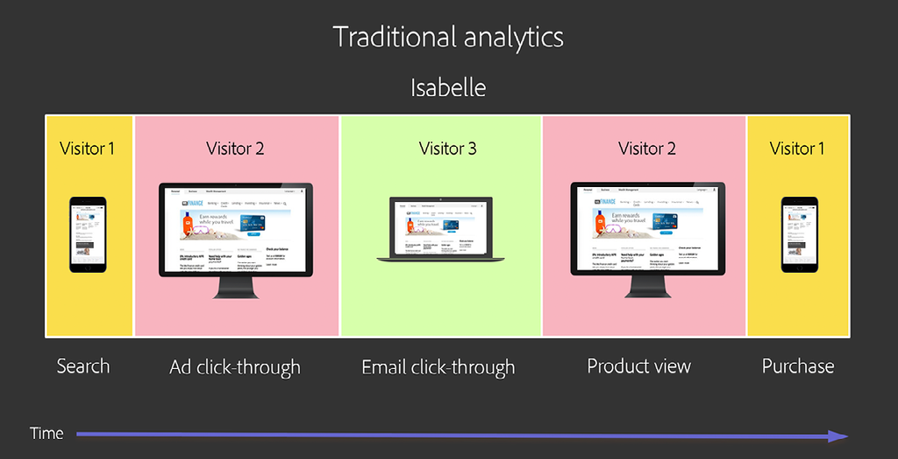
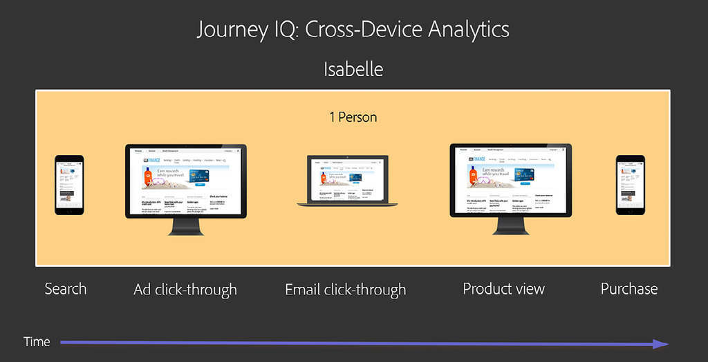
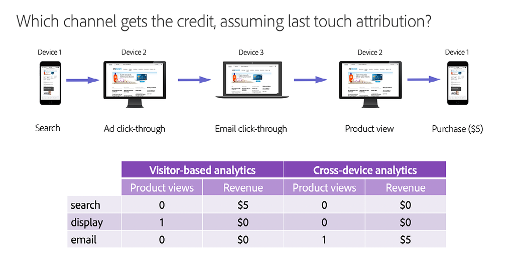
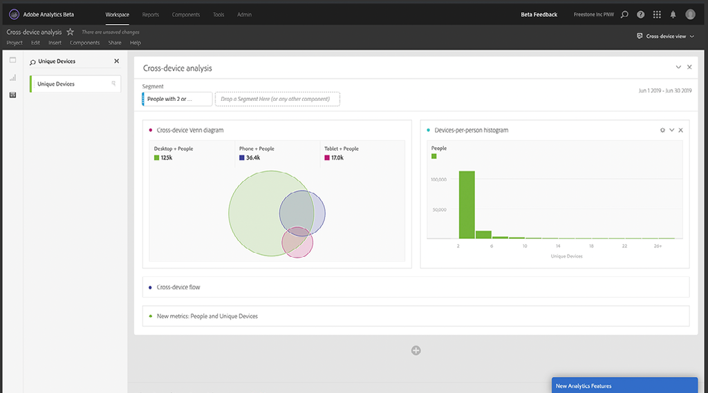

# Understanding and Using [!DNL Journey IQ] - Cross-Device Analytics

When users interact with your brand they do so in many ways and on multiple devices. Cross-Device Analytics integrates with the [!DNL Adobe Experience Platform Identity Service] to identify how devices map to people. It then leverages this intelligence to create a cross-device view of user behavior. This results in being able to do analysis on people, not devices.

## Overview of Cross-Device Analytics

### I Am Not My Devices

When users interact with your brand they do so in many ways and on multiple "surfaces" or "devices." They might use a web browser on a PC or mobile device, or they may use a mobile app. In traditional digital analytics, which grew up in data collection based on cookies, each of these surfaces is represented as a unique "visitor." This means each of your human users is represented as a multiple unique visitors.

Here's an example. Suppose Isabelle interacted with your brand in the following way:

*Isabelle is three visitors*

Using traditional analytics, Isabelle's journey is fractured into three pieces. She is represented as three unique visitors, each of whom used a different device to perform isolated tasks. What is needed is a unified, cross-device view of Isabelle's interactions. [!DNL Journey IQ: Cross-Device Analytics] provides this view.

*Isabelle is one person*

### A Cross-Device View Provides Better Analytics

Having a person-centric, cross-device view of Isabelle's behavior can make a significant difference to your analysis. For example, the traditional visitor-based approach doesn't give you the complete picture of marketing channel effectiveness. Let's look at Isabelle's journey once again, focusing in on which channel receives credit for her product view and for her purchase. We'll use [!UICONTROL last-touch] attribution for simplicity, but the same problem occurs using any attribution model when you divide Isabelle's behavior up into separate visitors. Using the traditional visitor-based view of the world gives very different, even misleading results:

*Traditional Analytics vs. Cross-Device Analytics*

Notice that with the cross-device view, the email channel receives credit for both the product view and the purchase, which more accurately represents Isabelle's real world experience.

Keep reading to learn about:

* How [!DNL Cross-Device Analytics] Works
* Prerequisites For [!DNL Cross-Device Analytics]
* Interpreting Cross-Device Data
* Analyzing Cross-Device Data in Analysis Workspace

## How [!DNL Cross-Device Analytics] Works

[!DNL Journey IQ: Cross-Device Analytics (CDA)] integrates with the [!DNL Adobe Experience Platform Identity Service], utilizing either the [[!DNL Co-op Graph]](https://experienceleague.adobe.com/docs/device-co-op/using/home.html) or [!DNL Private Graph] to identify how devices map to people. It then leverages this intelligence to create a cross-device view of user behavior. CDA includes unrivaled capabilities and tools to help your enterprise understand multi-device usage and the customer experience across those devices in their interactions with your brand. It sits as a layer below Analysis Workspace to provide deep insight into person-based audience analysis and cross-device attribution, segmentation and journey analysis using powerful tools such as [!UICONTROL Fallout], [!DNL Flow], [!DNL Cohort], [!DNL Segment IQ] and [!DNL Attribution IQ].

### The [!DNL Cross-Device Virtual Report Suite]

CDA is presented through a special kind of cross-device [[!UICONTROL Virtual Report Suite]](https://experienceleague.adobe.com/docs/analytics/components/virtual-report-suites/vrs-about.html). This allows you to continue to use the original device-based report suite as you introduce cross-device analytics into your organization. Setting up a CDA VRS is easy.

In step one of the VRS builder, choose the [!UICONTROL report suite] that has been configured by Adobe as CDA-enabled:

*Choose a CDA-enabled base (source) [!UICONTROL report suite]*
![[!UICONTROL Virtual Report Suite] Step One](assets/cda-vrs-step-one.png)

Then turn on [!UICONTROL Report Time Processing] and enable [!UICONTROL cross-device stitching]:

*Enable [!UICONTROL report-time processing] and [!UICONTROL cross-device stitching]*
![[!UICONTROL Virtual Report Suite] Step Two](assets/cda-vrs-step-two.png)

Finish the VRS setup and save it. The CDA VRS will show up in Analysis Workspace with a special icon next to it as shown below:

*Select the CDA VRS in Analysis Workspace*
![[!UICONTROL Virtual Report Suite] Step Three](assets/cda-vrs-step-three.png)

>[!TIP]
>
>You may create as many CDA [!UICONTROL virtual report suites] as you like on top of the CDA-enabled base [!UICONTROL report suite].

### Restating History

Sometimes it takes a while for your users to log in and for the [!DNL Co-op Graph] or [!DNL Private Graph] to identify them and map together their devices. CDA utilizes a 30-day look-back window, allowing it to restate a previously unidentified visitor as a person up to 30 days in the past.

How does this help? Recall Isabelle's user journey from the discussion above:

![[!DNL Cross-Device Analytics] Journey](assets/cda-isabelle-journey-cross-device-analytics.png)

It is possible that Isabelle did not log in until just prior to making the purchase, and that the [!DNL Co-op Graph] or [!DNL Private Graph] did not map together Isabelle's devices until sometime after her purchase. But CDA's 30-day look-back allows CDA to restate Isabelle's past behavior at a person level, providing you with the cross-device view of her journey that you need.

>[!NOTE]
>
>Since history can be restated, this means your data may change over time in a CDA-enabled [!UICONTROL virtual report suite]. Keep this in mind as you communicate insights from a CDA-based analysis.

## Prerequisites For [!UICONTROL Cross-Device Analytics]

CDA is included with [[!DNL Analytics Ultimate]](https://helpx.adobe.com/legal/product-descriptions/adobe-analytics.html). Beginning in September 2019, [!DNL Analytics Ultimate] customers who meet the prerequisites listed below are eligible to use CDA. The prerequisites for CDA are as follows:

* Your company must be a member of the [!DNL Adobe Experience Platform Identity Service] [[!DNL Co-op Graph]](https://experienceleague.adobe.com/docs/device-co-op/using/home.html), or use an [!DNL Adobe Experience Platform Identity Service Private Graph].
* You must implement everything required for [!DNL Co-op Graph] or [!DNL Private Graph] including [Experience Cloud ID (ECID)](https://experienceleague.adobe.com/docs/id-service/using/home.html) and ID syncing with the graph. Note that in addition to technical requirements, the [!DNL Co-op Graph] has other legal and contractual requirements.
* It is not currently possible to use two IMS orgs with a single [!DNL Private Graph], so you must standardize on a single IMS org. In some cases it is possible for a customer with multiple IMS orgs to use the [!DNL Co-op Graph] in conjunction with CDA.
* The [!DNL Co-op graph] and [!DNL Private Graph], as well as certain components of CDA are hosted in [!DNL Microsoft Azure]. This means [!DNL Analytics] data is copied back and forth between Adobe's data processing center and Adobe's presence in [!DNL Microsoft Azure]. Some [!DNL Analytics] data will be stored in [!DNL Azure]. Your company must agree to this arrangement.
* CDA requires a "cross-device" [!UICONTROL report suite]. That is, the [!UICONTROL report suite] you use for CDA must include data from multiple different device types or "surfaces" such as desktop web, mobile web, and mobile app. As of September 2019, the server call volume for this [!UICONTROL report suite] must be 100MM server calls/day or less. (Server call volume limits will increase over the coming months.)
* As of September 2019, the [!DNL Co-op Graph] and [!DNL Private Graph] are available in North America only. The schedule for graph presence in EMEA and APAC will be announced at a future time. If you are in those regions we encourage you to start looking at these prerequisites now so that you are ready to go when the graph becomes available.

## Interpreting Cross-Device Data

### People Not Visitors

Within the CDA [!UICONTROL Virtual Report Suite], you'll see a few changes. For example, the [!UICONTROL Unique Visitors] metric is replaced by two new metrics: [!UICONTROL People] and [!UICONTROL Unique Devices]. These new metrics give you far better insight into audience size.

*People and Unique Devices*
![CDA [!UICONTROL People Metric]](assets/cda-people-metric.png)

In the [[!UICONTROL Segment Builder]](https://experienceleague.adobe.com/docs/analytics/components/segmentation/segmentation-workflow/seg-build.html), the [!UICONTROL Visitor] segment container has been replaced by a [!UICONTROL Person] segment container. Using a CDA VRS, you can create cross-device segments such as:

* People who use more than one device
* People who begin their journey on a mobile device and then later purchase on a desktop device
* Visits where people use more than one device to accomplish a task

*Person-level segments*
![[!DNL Segment Builder] [!UICONTROL Person] Container](assets/cda-segment-builder-person-container.png)

### Dimension Persistence

Within a CDA VRS, dimensions such as [!DNL eVars] now automatically persist across devices. For example, an [!DNL eVar] that is configured as:

* Allocation: Most Recent (Last)
* Expire after: Purchase

will now automatically persist from one device to another until the Purchase event is fired.

## Analyzing Cross-Device Data in Analysis Workspace

### Person-Based Audience Analysis

Have you ever wondered how many people are interacting with your brand? Have you wanted to understand how many and what type of devices they use? How does their usage overlap? Using a CDA VRS, you can create cross-device [Venn diagrams](https://experienceleague.adobe.com/docs/analytics/analyze/analysis-workspace/visualizations/venn.html) and devices-per-person [histograms](https://experienceleague.adobe.com/docs/analytics/analyze/analysis-workspace/visualizations/histogram.html).

*Person-based audience analysis*

### Cross-Device [!DNL Flow]

With CDA and Analysis Workspace, you can visualize how people are moving from one device to another over time in the [[!DNL Flow visualization]](https://experienceleague.adobe.com/docs/analytics/analyze/analysis-workspace/visualizations/flow/flow.html). You can see where they drop out in their journey, and where they carry on.

*[!DNL Flow] with CDA*
![[!DNL Flow Visualization]](assets/cda-flow-viz.png)

### Cross-Device [!DNL Fallout]

You likely use several [[!DNL Fallout visualizations]](https://experienceleague.adobe.com/docs/analytics/analyze/analysis-workspace/visualizations/fallout/fallout-flow.html) to analyze how well users make it through a given series of steps prior to achieving success. Did you know your view of those [!DNL Fallout visualizations] is limited when using traditional device-based analytics? In order to successfully "fall-through", the next step must occur in the same browser or app as the previous step. In device-based analytics, you are blind to people who successfully complete the next step on another device.

Not to worry, CDA has you covered. CDA creates the cross-device view that makes [!DNL Fallout visualizations] much, much more useful. After all, what really matters is whether the person ultimately succeeded in their task somewhere.

*[!DNL Fallout] with CDA*
![[!DNL Fallout Visualization]](assets/cda-fallout-viz.png)

### [!DNL Cross-Device Attribution IQ]

Because CDA creates a layer of cross-device data underneath Analysis Workspace, all your analysis will be flavored with a cross-device perspective. One powerful example is through [[!DNL Attribution IQ]](https://experienceleague.adobe.com/docs/analytics/analyze/analysis-workspace/panels/attribution/attribution.html). [!DNL Attribution IQ] in Analysis Workspace allows you compare multiple attribution models side-by-side. Using this capability with CDA, you can now compare how different devices contribute to success.

For example, suppose you want to understand how often a mobile phone is the first device used in an interaction that ultimately leads to success. This represents the "acquisition rate" of the mobile phone. CDA + [!DNL Attribution IQ] allows you to do this analysis:

*[!DNL Attribution IQ] with CDA*
![[!DNL Attribution IQ]](assets/cda-attribution-iq.png)

For more information, see the [[!DNL Cross-Device Analytics] help documentation](https://experienceleague.adobe.com/docs/analytics/components/cda/cda-home.html).
