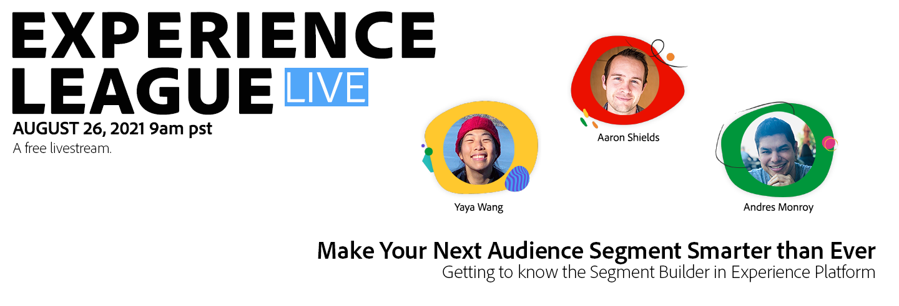
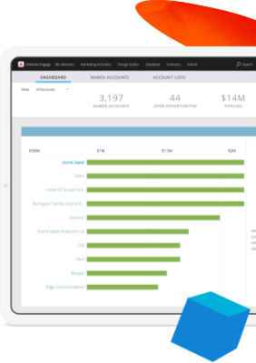
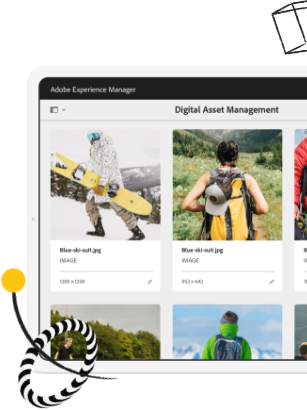
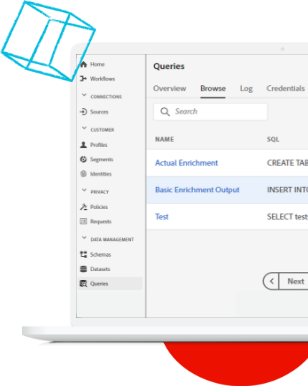
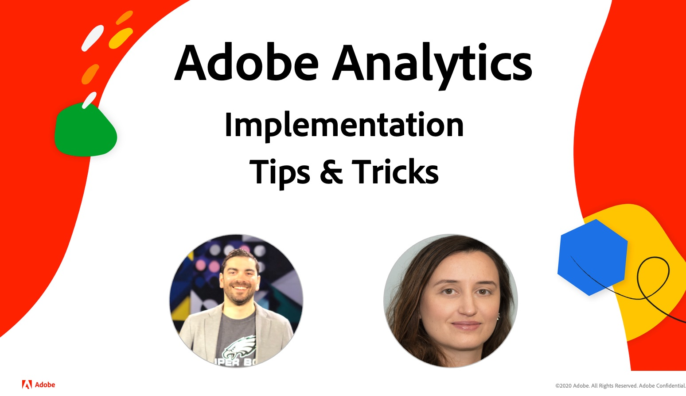

# Experience League LIVE

## Join us for the next episode !

Experience League LIVE is a live streaming show produced by the Experience League team.  It's a chance to connect with Adobe product experts and learn actionable tips, tricks, and strategies you can apply with the Adobe Experience Cloud applications.

## Upcoming Experience League LIVE events!

<table>
<tr>
  <td>
      
     

          <strong>Customer Journeys</strong>
     

     

          <em>September 2021</em>
     

    

    <em>Learn from product experts about building experiences that adapt to customers in real time</em>
    

  </td>
  <td>
      
     

          <strong>Content and Commerce</strong>
     

          <em>October 2021</em>
     

     

    

    <em>Learn how to create and manage content at scale and build personalized commerce experiences</em>
    

  </td>
  <td>
      
     

          <strong>Experience Platform</strong>
     

     

          <em>December 2021</em>
     
    
    

    <em>Learn from product experts about building experiences that adapt to customers in real time</em>
    

  </td>
</tr>
</table>

## Past episodes

Did you miss an episode of Experience League LIVE? We forgive you. Check out any of our past episodes!

<table>
<tr>
  
  <td>
    
     

          <strong>Guests</strong> : <i>Eric Matisoff and Dasha Fitzpatrick</i>
     

     

          <em>July 29, 2021</em>
     
    
    

    <em></em>
    

  </td>
</tr>
</table>

>[!TIP]
>
>For additional methods of learning, check out our free [courses](https://experienceleague.adobe.com/#dashboard/learning) as well as individual [tutorials](https://experienceleague.adobe.com/docs/home-tutorials.html).
