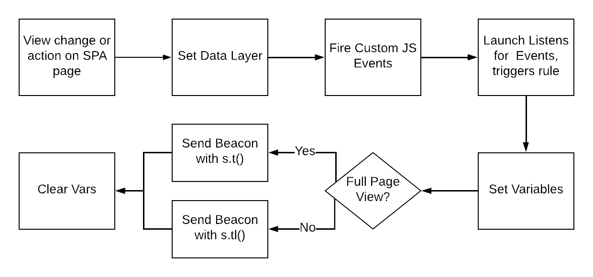

# Implementation best practices for Single Page Applications (SPAs) {#implementation-best-practices-for-single-page-appliations}

Learn some best practices for implementing [!DNL Adobe Analytics] on Single Page Applications (SPAs). This includes using [!DNL Experience Platform Tags], the recommended implementation method.

INITIAL NOTES:

* The content below references the use of [!DNL Experience Platform Tags] to implement Adobe Analytics on your site. These considerations apply if [!DNL Experience Platform Tags] is not used, therefore, you must adapt them to your implementation method.
* There are differences in SPAs, therefore, you should adjust your approach accordingly to best meet your needs.

## Simple diagram of working with SPAs in [!DNL Experience Platform Tags] {#simple-diagram-of-working-with-spas-in-tags}



**NOTE:** This is a simplified diagram of how SPA pages are handled in an Adobe Analytics implementation using [!DNL Experience Platform Tags]. The following sections identify steps and issues to consider.

## Set the data layer {#set-the-data-layer}

When new content is loaded or when an action occurs on a SPA page, *update the data layer first*. This must happen **before** a custom event that triggers a rule executes in [!DNL Experience Platform Tags]. This ensures that the correct values from the data layer are pushed into Tags and then Adobe Analytics.

The following is a sample data layer. Any of these elements may change based on the initial view or subsequent change of the view given an  action taken on your SPA page. For example, on a full or majority view change, it is a common requirement to pass in a unique "[!DNL pageName]" value to differentiate between the views in Adobe Analytics reporting.

```JavaScript
<script>
    digitalData = {
        pageInstanceID: "Launch Demo Site",
        page:{
            pageInfo:{
                pageID: '2745374',
                pageName: 'acs demo - product listing page'
            },
            attributes:{
                project: "Experience Platform Launch Project"
            }
        },
        user : [ {
          "profile" : [ {
            "attributes" : {
              "gender" : "male",
              "age" : "35"
            }
          } ]
        }],
        libraries : {
          adobe : {
            launch : {
              state : 0, // 0 = not loaded , 1 = loaded
              domain : "assets.adobedtm.com"
            }
          }
        }

     };
    </script>

```

## Set custom events and listen for these events in [!DNL Experience Platform Tags] {#setting-custom-events-and-listening-in-tags}

When new content loads or when an action occurs on the SPA page, Experience Platform Tags needs to be informed to run a rule that sends data to [!DNL Analytics]. There are a couple approaches for this: [!UICONTROL Direct Call rules] or Custom Events.

* [!UICONTROL Direct Call rules]: Set up a [!UICONTROL direct call rule] that executes when it is called directly from the page. If the page load or action is simple or unique and can execute a specific set of instructions every time (for example, set [!DNL eVar4] to X and trigger [!DNL event2] every time), then this approach is suitable. Refer to [!DNL Experience Platform Tags] documentation for more details about creating [!UICONTROL direct call rules].
* Custom Events: If you need to dynamically attach a payload with unique values for events that occur on SPA pages, use custom JavaScript events, and listen for them in [!DNL Experience Platform Tags]. Use the payload to set data elements and Analytics variables in Tags. This method is considered the best practice, as this need is typically prevalent for SPAs. Our examples below use the custom events method.

**Examples:** [In this](https://experienceleague.adobe.com/docs/experience-manager-learn/sites/spa-editor/spa-editor-framework-feature-video-use.html) help document, there are links to sample SPA sites that implement [!DNL Analytics] and other Experience Cloud solutions. In these  examples, the following custom events are used:

* **[!DNL Event-view-start]**: Execute on the view start of the view/state that loads.
* **[!DNL Event-view-end]**: Execute when a view/state change occurs and all SPA components on the page finish loading. This is the event that typically sends data to Adobe Analytics.
* **[!DNL Event-action-trigger]**: Execute when any event occurs on the page except view/state load. Examples of this include a click event or a smaller content change without a view change.

Refer to the pages and docs referenced above for more information about how and when these events fire. You do not need to use the same event names in your implementation. The functional use case for the method used is essential to understand as the recommended best practice for each. The following video demonstrates a sample SPA page and sample code in [!DNL Experience Platform Tags] that listens for the custom events.

>[!VIDEO](https://video.tv.adobe.com/v/23024/?quality=12)

## Execute s.t() or s.tl() in the [!DNL Experience Platform Tags] {#running-s-t-or-s-tl-in-the-launch-rule}

An important concept to understand for [!DNL Analytics] when working with a SPA is the difference between `s.t()` and `s.tl()`. Your code triggers one or the other of these methods in [!DNL Experience Platform Tags] to send data into [!DNL Analytics].

* **s.t()** - The "t" stands for "track", and this represents a page view. If the view changes enough that you  *consider* it a new "page", use this call. Set a unique value to the [!DNL s.pageName] variable and use `s.t()` to send the data into [!DNL Analytics].

* **s.tl()** - The "tl" stands for "track link", and this represents a link click or small content change. If the view change is minimal, use `s.tl()` to pass in a unique value about the interaction to [!DNL Analytics]. This variable passed in is not [!DNL s.pageName], as this is ignored in Analytics when `s.tl()` calls are received. 

**TIP:** As a general guideline, if the screen changes by more than 50%, use the `s.t()` page view call. Otherwise, use `s.tl()`. However, use your judgment when considering actions that constitute a new "page" and how that should be presented in Adobe Analytics reports.

The following video shows where and how to trigger `s.t()` or `s.tl()` in Tags.

>[!VIDEO](https://video.tv.adobe.com/v/23048/?quality=12)

## Clear Variables {#clear-variables}

Send the right data into [!DNL Analytics] at the right time. In a SPA environment, a value stored in an [!DNL Analytics] variable persists and resends into [!DNL Analytics], potentially when you no longer want it. A function exists in the [!DNL Analytics] [!DNL Tags] extension to clear the variables to ensure that the next call doesn't errantly send data into [!DNL Analytics].

The diagram above shows variables cleared *after* you send in data. In reality, this can happen before OR after the call, however, be consistent in your [!DNL Experience Platform Tags] rules for a cleaner implementation. If you clear variables *before* you execute `s.t()`, set the new variables immediately after the call and then proceed to send the new data into [!DNL Analytics].

**NOTE:** Clearing variables is not always needed when running `s.tl()`. This call requires the use of the [!DNL linkTrackVars] variable to instruct [!DNL Analytics] which variables to set. This happens automatically [!DNL Experience Platform Tags] through configuration. It prevents errant variables from setting in contrast to the behavior with `s.t()` calls in a SPA environment. To ensure the cleanest and most reliable implementation, it is likely easier to use the clear variables function for both calls in a SPA environment.

The following video shows where and how to clear variables in [!DNL Tags].

>[!VIDEO](https://video.tv.adobe.com/v/23049/?quality=12)

## Additional considerations {#additional-considerations}

### Custom Code windows in [!DNL Experience Platform Tags] {#custom-code-windows-in-tags}

In the [!DNL Tags] [!DNL Analytics] extension, there are two places where custom code may be inserted: The "[!UICONTROL library management]" and "[!UICONTROL Configure tracker using custom code]" sections.


Either one of these locations runs the code contained therein once for the initial page load your SPA page. If the code should run on a view or action change, implement that code in the appropriate **[!UICONTROL rule]** (for example, the "page load: event-view-end" rule), to ensure that the code executes every time the [!UICONTROL rule] runs. When creating thet action in the [!UICONTROL rule], set *Extension = Core* and *Action Type = Custom Code*.

### "Hybrid" SPA and traditional sites {#hybrid-spa-and-traditional-sites}

Some sites are comprised of a combination of traditional and SPA pages. In this instance, use a strategy that works for both page types. When configuring your custom events on the site and triggering rules in [!DNL Experience Platform Tags], ensure that double hits aren't sent into [!DNL Analytics] based on hash changes, and so on. In this case, suppress one of the page views to prevent duplicate data passed into Adobe Analytics.

If you decide to separate the functionality into unique [!UICONTROL rules] for more control, remember to document that you have done this. If you change one [!UICONTROL rule], make the same change to the other [!UICONTROL rule].

### Integration with [!DNL Target] using A4T {#integration-with-target-using-a4t}

When integrating with [!DNL Target] using A4T, confirm that the [!DNL Target] and [!DNL Analytics] requests sent in on the same view or action pass the same SDID parameter value. This ensures that your data properly synchronizes in the backend.

To view these hits, use a debugger or packet monitoring tool. Adobe provides an Experience Platform Debugger for this purpose. It's a Chrome extension that can be [downloaded here](https://chrome.google.com/webstore/detail/adobe-experience-platform/bfnnokhpnncpkdmbokanobigaccjkpob?hl=en). [!DNL Target] should execute first on the page. This can be verified in the debugger, as well. 

## Additional resources {#additional-resources}

* [SPA discussion on the Adobe forums](https://experienceleaguecommunities.adobe.com:443/t5/adobe-experience-platform-launch/best-practices-for-single-page-apps/m-p/267940)
* [Reference Architecture sites to show how to implement SPA in Experience Platform Launch](https://experienceleague.adobe.com/docs/experience-manager-learn/sites/spa-editor/spa-editor-framework-feature-video-use.html)
