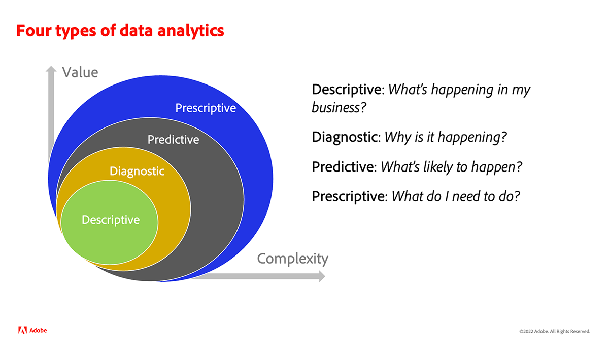
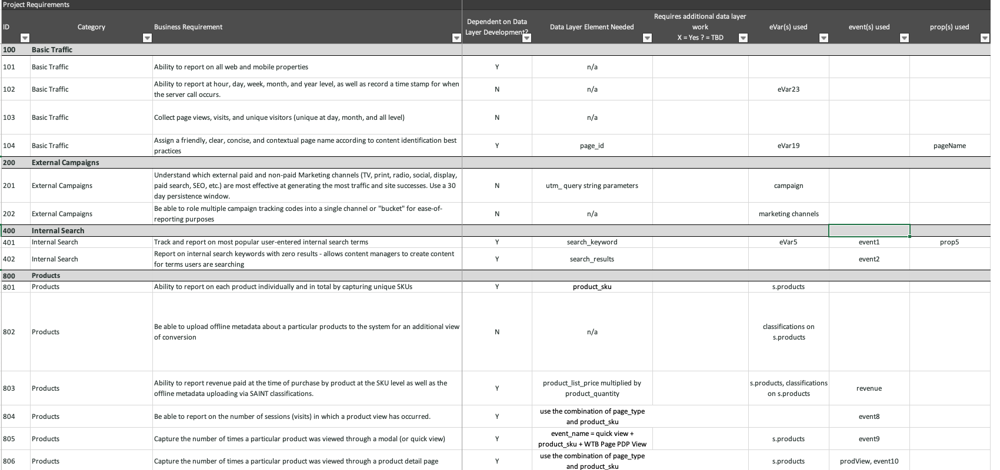
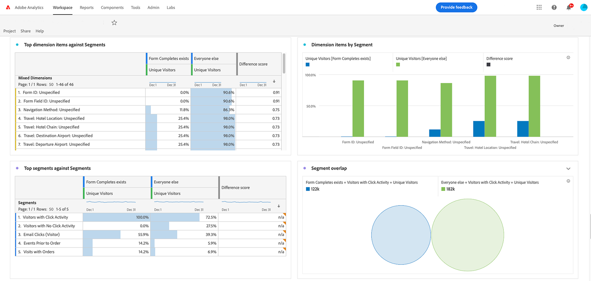

# What is analytics?{#what-is-analytics}

Before you immerse yourself into the content to learn Adobe Analytics, it's helpful to understand the answer to this fundamental question, "What is Analytics?" Analytics is a broad term that encompasses multiple disciplines for driving business development and transformation, namely business, and data analytics. There is a distinction between the two. Let's have a closer look.

## The role of business analytics

In recent years, the birth and maturity of using the internet for commercial purposes has exploded, and so has the amount of data amassed by organizations about how consumers interact and engage in their brand. If you've heard the term Big Data before, this falls into the realm of business analytics. 

Business analytics is a component of business intelligence and focuses on big-picture strategic risks and opportunities. It's a necessary capability that companies must possess to remain competitive in their industry. 

There are four types of business analytics: 

* **Descriptive**: This involves using historical data to identify trends in an organization's business. For example, a retailer needs to predict product demand before peak or Holiday seasons and requires optimal inventory to achieve its business goals.
* **Diagnostic**: What are the reasons behind an unexpected outcome? Why was there a dramatic demand for a product or service during the off-peak season? Diagnostic analysis is a deeper form of descriptive analysis and aims to draw correlations from the data.
* **Predictive**: This uses historical data to determine probable outcomes or events. Machine learning (ML) and artificial intelligence (AI) are commonly used for more accurate predictions. Customer churn is an example of a real-world application of predictive analysis. This analysis finds correlations to identify the attributes of customers who are likely to churn so that you can do something to prevent it.
* **Prescriptive**: This is an advanced form of predictive analysis that aims to uncover the best possible path to a desired outcome. This type of analysis uses ML and AI technologies as well. Retailers use prescriptive analysis to improve margins by making changes in their operations.

## The role of data analytics

Data analytics uses many of the same technologies used in business analytics, but it's broader in scope and more technical in nature. Big data analysis, for example, relies on the quality and organization of data. How effectively is the data sorted, stored, and cleansed? Data scientists work in the realm of data analytics. They transform massive data sets that business analysts then use to communicate information to the organization to optimize processes and metrics. Data scientists take deeper dives into the data, determining trends and connections. 

## Where does Adobe Analytics fit?

Adobe Analytics is a robust data analysis platform that collects data from multi-channel digital experiences that support the customer journey and provides tools for analyzing the data. It's a platform commonly used by marketers and business analysts for business analytics purposes. 

Business requirements, data design, and data collection are key factors for an effective analytics practice. Initially, customers start with collecting data about key customer journeys and desired business outcomes for traditional digital experiences, like web and mobile. The data should answer questions like:

* "Which content and content types are popular with visitors?"
* "Which paths result in high-value conversions, such as revenue, bookings, leads, or subscriptions?"
* "Which products, services or content should I show to known and unknown visitors"?
* "How are digital marketing channels performing?"

Once the data foundation is collected into Adobe Analytics, marketers and business analysts use various reports and data visualization tools available in the product to perform analysis and tell meaningful stories about the data. Moreover, Adobe Analytics provides various forms of outputs. It could be a segment or audience that is sent to an optimization tool, like Adobe Target, to run A/B tests. It could be a predictive score to indicate the likelihood of an action by a person that is used by another system for modeling. 

Over time, customers enrich traditional web and mobile data with other channel sources, including CRM, call center, brick and mortar, voice assistants, and more. Adobe Analytics offers multiple ways to capture data from virtually any channel source to build a robust analytics data foundation. 

Collecting additional datasets opens the door to performing more advanced types of prescriptive data analysis that use machine learning or advanced data models, such as marketing attribution and anomaly detection.

We encourage you to engage with the tutorials on Experience League to guide you through the key benefits and capabilities of Adobe Analytics.
