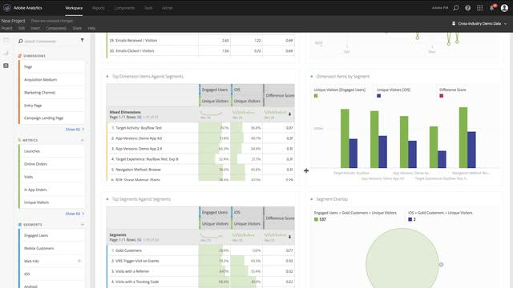
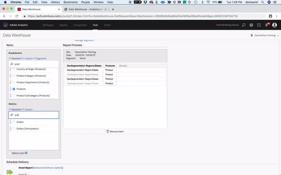

# Overview

Welcome to the Analytics Tutorials Site.  Using these tutorials along with the [documentation](https://docs.adobe.com/content/help/en/analytics/landing/home.html) will give you a better understanding how to use Adobe Analytics to gain customer insights faster than ever.  To get started, 
* See the **"What's New"** section below for the latest goodies
* **Staff Picks** highlights some of our favorite content 
* Explore the content by topic and subtopic in the **left navigation**
* Use the **search** field at the top of the page if you know what you are looking for

## What's New

* **[Getting Started with Adobe Mobile Analytics (Video)](mobile-app-analytics/measuring-mobile-analytics/getting-started-with-mobile-analytics.md)**
     
    *Learn how to get started with Adobe Analytics for mobile apps using templates.*

* **[Impact of Touchpoints Across Mobile Journey (Video)](mobile-app-analytics/measuring-mobile-analytics/impact-of-touchpoints-across-mobile-journey.md)**
     
    *Learn how mobile app users are influenced by touch-points.*

* **[Analyzing User Behavior Across Channels (Video)](mobile-app-analytics/measuring-mobile-analytics/analyzing-user-behavior-across-channels.md)**
     
    *Define and measure conversion in multi-step processes to drive success to your mobile apps.*

## Staff Picks

<table>
<tr>
  <td>
    
    

      <a href="measuring-mobile-analytics/how-to-increase-engagement-and-retention-rates.md">
    <strong>How To Increase Engagement and Retention Rates</strong>
    </a>
    

    

    <em>Identify engaged audiences by their behavior.</em>
    

  </td>
   <td>
    
    

      <a href="exporting/data-warehouse/introduction-to-data-warehouse.md">
    <strong>Introduction to Data Warehouse</strong>
    </a>
    

    

    <em>Learn to query raw data with the Data Warehouse tool.</em>
    

  </td>
  <td>
    
    

      <a href="analysis-workspace/analysis-workspace-basics/analysis-workspace-overview.md">
    <strong>Analysis Workspace Overview</strong>
    </a>
    

    

    <em>High-level overview of Analysis Workspace.</em>
    

  </td>
</tr>
</table>
