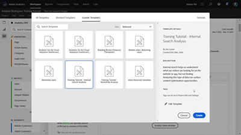

# Overview

Welcome to the [!DNL Analytics] Tutorials Site.  Using these tutorials along with the [documentation](https://docs.adobe.com/content/help/en/analytics/landing/home.html) will give you a better understanding how to use Adobe Analytics to gain customer insights faster than ever.  To get started, 
* See the **"What's New"** section below for the latest goodies
* **Staff Picks** highlights some of our favorite content 
* Explore the content by topic and subtopic in the **left navigation**
* Use the **search** field at the top of the page if you know what you are looking for

## What's New

* **[Right-click for Workspace Efficiency (Video)](analysis-workspace/navigating-workspace-projects/right-click-for-workspace-efficiency.md)**
     
    *Learn about all of our favorite Analysis Workspace right-clicks and how to use them. From [!UICONTROL Freeform Tables] to [!UICONTROL Fallout Visualizations], right-clicking will make you more efficient and proficient in [!DNL Workspace].*

* **[Quick Insights Panel in Analysis Workspace (Video)](analysis-workspace/using-panels/quick-insights-panel-in-analysis-workspace.md)**
     
    *Quick Insights provides guidance for non-analysts and new users of Analysis Workspace to learn how to answer business questions quickly and easily.*

* **[Project Sharing in Analysis Workspace (Video)](analysis-workspace/curate-and-share-projects/project-sharing-in-analysis-workspace.md)**
     
    *Project sharing is one way to democratize data and insights from Analysis Workspace to users in your organization. You can place recipients in one of three project roles, depending on the project experience you want them to have - Edit, Duplicate and View.*

## Staff Picks

<table>
<tr>
  <td>
    
    

      <a href="analysis-workspace/attribution-iq/algorithmic-model-in-attribution-iq.md">
    <strong>Algorithmic Model in Attribution IQ</strong>
    </a>
    

    

    <em>The Algorithmic Attribution model in Analysis Workspace uses statistical techniques to dynamically determine the optimal allocation of credit for the selected metric.</em>
    

  </td>
   <td>
    
    

      <a href="analysis-workspace/navigating-workspace-projects/training-tutorial-template-in-analysis-workspace.md">
    <strong>Training Tutorial Template in Analysis Workspace</strong>
    </a>
    

    

    <em>The Analysis Workspace Training Tutorial walks users through common terminology and steps for building their first analysis in Workspace.</em>
    

  </td>
  <td>
    
    

      <a href="analysis-workspace/analysis-workspace-basics/analysis-workspace-overview.md">
    <strong>Analysis Workspace Overview</strong>
    </a>
    

    

    <em>High-level overview of Analysis Workspace.</em>
    

  </td>
</tr>
</table>
