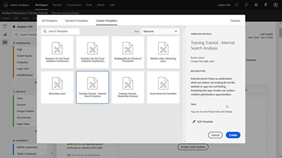
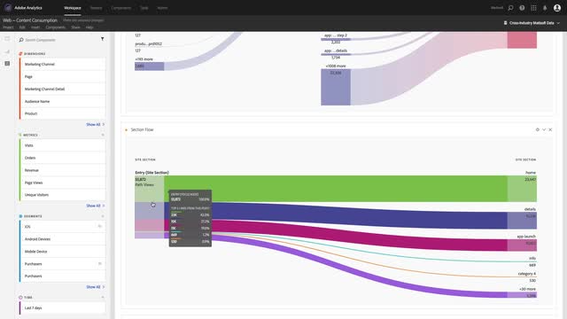

# Analytics tutorials

Get the most out of [!DNL Adobe Analytics]. Use these tutorials to learn the features of Analytics and reap the benefits for your business. This content is suitable for administrators, data analysts, marketers, developers, and architects. 
  
To get started, 

* See the **"What's New"** section below for the latest updates and features
* **Staff Picks** highlights some of our favorite content 
* Explore the content by topic and subtopic in the **left navigation**
* Use the **search** field at the top of the page if you know what you want to learn

Curated learning experiences by role and skill level are also offered in the courses section. Simply sign-in with your Adobe ID and navigate to **Learn > Recommended courses** in the top navigation.

## Staff picks

<table>
<tr>
  <td>
    
    

      <a href="analysis-workspace/attribution-iq/algorithmic-model-in-attribution-iq.md">
    <strong>Algorithmic Model in Attribution IQ</strong>
    </a>
    

    

    <em>The Algorithmic Attribution model in Analysis Workspace uses statistical techniques to dynamically determine the optimal allocation of credit for the selected metric.</em>
    

  </td>
   <td>
    
    

      <a href="analysis-workspace/navigating-workspace-projects/training-tutorial-template-in-analysis-workspace.md">
    <strong>Training Tutorial Template in Analysis Workspace</strong>
    </a>
    

    

    <em>The Analysis Workspace Training Tutorial walks users through common terminology and steps for building their first analysis in Workspace.</em>
    

  </td>
  <td>
    
    

      <a href="analysis-workspace/analysis-workspace-basics/analysis-workspace-overview.md">
    <strong>Analysis Workspace Overview</strong>
    </a>
    

    

    <em>High-level overview of Analysis Workspace.</em>
    

  </td>
</tr>
</table>

  
## Additional resources

[Adobe Analytics documentation](https://experienceleague.adobe.com/docs/analytics.html)
